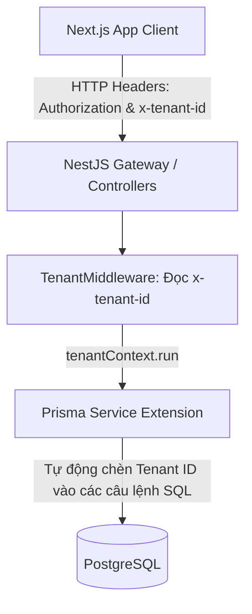
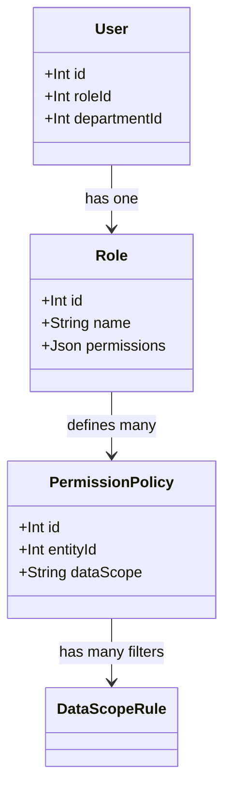
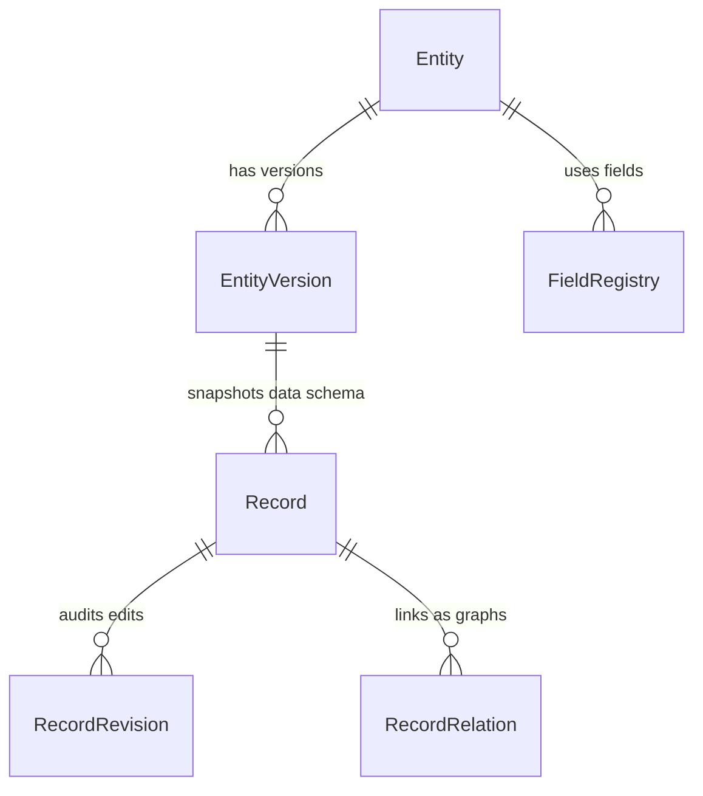
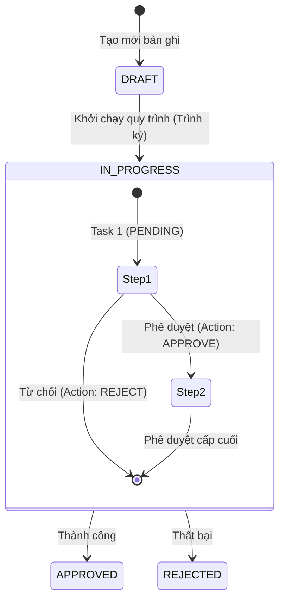

# TÀI LIỆU TÍCH HỢP HỆ THỐNG BACKEND (API INTEGRATION GUIDE)
## Dành cho Kỹ sư Frontend (Next.js - TypeScript)

Chào mừng bạn đến với tài liệu hướng dẫn tích hợp API hệ thống **BOS (Business Operating System)**. Tài liệu này cung cấp toàn bộ thông tin kỹ thuật cần thiết để các lập trình viên Frontend nắm bắt được kiến trúc, luồng nghiệp vụ, cấu trúc dữ liệu và cách tương tác hiệu quả với các API của hệ thống Backend NestJS.

---

## 1. KIẾN TRÚC HỆ THỐNG & MULTI-TENANCY

Hệ thống BOS hoạt động theo mô hình **SaaS Multi-Tenancy (Một cơ sở dữ liệu duy nhất - Single Database)**. Toàn bộ dữ liệu của các doanh nghiệp (Tenants) được tách biệt hoàn toàn ở lớp logic nhờ vào Middleware và Prisma Extension ở Backend.



### Nguyên tắc hoạt động ở Backend:
1. **Cô lập theo ngữ cảnh xử lý (Thread context):** Sử dụng `AsyncLocalStorage` trong Node.js để lưu giữ `tenantId` cho mỗi tiến trình xử lý request độc lập (`tenantContext`).
2. **Tự động áp dụng bộ lọc (Automatic Tenant Filtering):** Một Prisma Extension đã được cài đặt để can thiệp vào tất cả các tác vụ truy vấn ($allOperations) của Prisma Client. Nếu Model thuộc diện quản lý của Tenant, hệ thống sẽ:
   - Tự động chèn thêm điều kiện `where: { tenantId: store.tenantId }` đối với các truy vấn đọc/ghi.
   - Tự động gán `data.tenantId = store.tenantId` khi thêm mới bản ghi.

> [!IMPORTANT]
> Các kỹ sư Frontend **không cần** lo lắng về việc truyền `tenantId` trong Request Body hay Query String khi thao tác với các thực thể con. Hệ thống sẽ tự giải quyết dưới Database dựa trên Header của HTTP Request.

---

## 2. CẤU HÌNH CLIENT API & AUTHENTICATION FLOW

### 2.1. Quản lý HTTP Headers
Để tương tác với các API cần xác thực và cô lập dữ liệu, Client phải gửi kèm hai Header bắt buộc sau:
1. `Authorization: Bearer <JWT_TOKEN>`
2. `x-tenant-id: <TENANT_ID>` (Mã định danh số nguyên của doanh nghiệp)

#### Cấu hình Axios Interceptors (`src/lib/axios.ts`):
Hệ thống Frontend hiện tại đã cấu hình tự động trích xuất các thông tin này từ `localStorage` để đính kèm vào mỗi request:

```typescript
import axios from "axios";

const axiosInstance = axios.create({
  baseURL: process.env.NEXT_PUBLIC_API_URL || "http://localhost:3000",
  headers: {
    "Content-Type": "application/json",
  },
});

// Interceptor tự động bắt Token và Tenant ID đồng bộ từ LocalStorage
axiosInstance.interceptors.request.use(
  (config) => {
    if (typeof window !== "undefined") {
      const token = localStorage.getItem("token");
      const tenantId = localStorage.getItem("tenant_id");

      if (token) {
        config.headers.Authorization = `Bearer ${token}`;
      }
      if (tenantId) {
        config.headers["x-tenant-id"] = tenantId;
      }
    }
    return config;
  },
  (error) => Promise.reject(error),
);
```

---

### 2.2. Luồng Đăng nhập & Đăng ký Doanh nghiệp mới

Hệ thống cung cấp hai cổng API công khai (Public APIs) chính:

#### 1. Đăng ký doanh nghiệp mới (Onboarding SaaS)
* **API:** `POST /api/v1/auth/register-tenant`
* **Mô tả:** Đăng ký doanh nghiệp mới, đồng thời tự động khởi tạo 1 tài khoản quản trị (Admin) và thiết lập các vai trò mặc định ban đầu.
* **Payload mẫu:**
```json
{
  "name": "Công ty Cổ phần Giải pháp BOS",
  "code": "bos_solution",
  "adminEmail": "admin@bos.vn",
  "adminPassword": "SecurePassword123!",
  "adminName": "Nguyễn Văn Admin"
}
```

#### 2. Đăng nhập hệ thống
* **API:** `POST /api/v1/auth/login`
* **Mô tả:** Đăng nhập để nhận JWT Token.
* **Lưu ý đặc biệt:** Cần truyền kèm header `x-tenant-id` hoặc mã doanh nghiệp để định danh luồng đăng nhập (do hệ thống cho phép trùng email ở các doanh nghiệp khác nhau nhưng email phải là duy nhất trong cùng một doanh nghiệp).
* **Code mẫu gọi API:**
```typescript
import axiosInstance from "@/lib/axios";
import { paths } from "@/types/api";

export type LoginRequest = paths["/api/v1/auth/login"]["post"]["requestBody"]["content"]["application/json"];

export const authService = {
  login: async (data: LoginRequest, tenantId: string) => {
    const response = await axiosInstance.post("/api/v1/auth/login", data, {
      headers: {
        "x-tenant-id": tenantId,
      },
    });
    return response.data; // Trả về { accessToken: "eyJhbG..." }
  },
};
```

---

## 3. PHÂN QUYỀN & BẢO MẬT DÒNG DỮ LIỆU (SECURITY & RLS)

Hệ thống sử dụng cơ chế kiểm soát truy cập dựa trên vai trò kết hợp với tầm nhìn dữ liệu (Role-Based Access Control + Data Scope Policies).



### Các cấp độ tầm nhìn dữ liệu (`dataScope`):
Khi truy vấn danh sách bản ghi hoặc kiểm tra quyền hành động, hệ thống kiểm duyệt dựa trên trường `dataScope` trong chính sách phân quyền (`PermissionPolicy`):
* `OWNED`: Chỉ được xem/sửa các bản ghi do chính tài khoản đó tạo ra (`createdById === userId`).
* `DEPARTMENT`: Được phép thao tác trên các bản ghi được tạo bởi thành viên cùng một phòng ban với người dùng (`departmentId === user.departmentId`).
* `SUB_DEPARTMENTS`: Được phép thao tác trên phòng ban của mình và toàn bộ các phòng ban con/cháu thuộc nhánh dưới (sử dụng cấu trúc bảng đóng **Closure Table** `department_closure` để phân tích đệ quy tốc độ cao).
* `ALL`: Được thao tác trên toàn bộ dữ liệu của doanh nghiệp (trong phạm vi tenant).

#### Cấu trúc tính toán phòng ban đệ quy đệ trình qua Closure Table:
Khi gọi lấy danh sách phòng ban nhánh dưới của một phòng ban bất kỳ:
* **API:** `GET /api/v1/departments/{id}/descendants`
* **Mô tả:** Trả về toàn bộ các phòng ban cấp dưới trực tiếp hoặc gián tiếp với thời gian truy vấn dưới 1ms nhờ index trên khóa chính đa trường `[tenantId, ancestorId, descendantId]`.

---

## 4. HỆ THỐNG METADATA ĐỘNG (LÕI LOW-CODE SYSTEM)

Lõi của nền tảng BOS là hệ thống cơ sở dữ liệu động, cho phép định nghĩa các biểu mẫu, trường dữ liệu và ghi nhận dữ liệu người dùng nhập theo cấu trúc linh hoạt.



### 4.1. Entities (Biểu mẫu / Thực thể) - `/api/v1/entities`
Đại diện cho cấu trúc của một bảng dữ liệu hoặc một mẫu đơn (ví dụ: Phiếu xin nghỉ phép, Đề xuất thanh toán, Danh mục thiết bị).
* **Đặc tính nâng cao:**
  - `displayMode`: Chế độ hiển thị danh sách (dạng tiêu đề, dạng bảng...).
  - `titlePattern`: Mẫu đặt tiêu đề tự động (ví dụ: `[Mã phiếu] - Đề xuất bởi [Tên người tạo]`).
  - `autoCodePattern`: Mẫu sinh mã tự động tăng (ví dụ: `DXTT-{YYYY}-{NNNN}`).

### 4.2. Fields (Trường dữ liệu) - `/api/v1/fields`
Cấu hình thuộc tính của các cột trong thực thể.
* **Các loại kiểu dữ liệu (`type`):**
  - Căn bản: `TEXT`, `NUMBER`, `DATE`, `BOOLEAN`, `TEXTAREA`.
  - Đặc biệt: `LOOKUP` (Liên kết chéo biểu mẫu), `FORMULA` (Công thức tính toán tự động), `ROLLUP` (Tính toán tổng hợp dữ liệu từ bảng con).

### 4.3. Records (Bản ghi dữ liệu) - `/api/v1/records`
Toàn bộ dữ liệu nhập của người dùng được lưu trữ trong cột `data` dưới dạng cấu trúc JSON động.

#### 1. Lấy danh sách bản ghi có bộ lọc vạn năng và phân trang
* **API:** `GET /api/v1/records`
* **Tham số truy vấn (Query Params):**
  - `entityId` (Bắt buộc): ID của Biểu mẫu cần lấy dữ liệu.
  - `page` / `limit`: Phân trang.
  - `sortBy` / `sortOrder`: Sắp xếp động theo trường dữ liệu (ví dụ: `total_amount` | `desc`).
  - `searchQuery`: Tìm kiếm văn bản đầy đủ (Full-Text Search qua trường index `searchVector`).
  - `filters`: Chuỗi JSON định dạng bộ lọc động (ví dụ: `{"plug_status":"DA_RUT"}`).
* **Code React Hook mẫu tích hợp nâng cao:**
```typescript
import { useQuery } from "@tanstack/react-query";
import axiosInstance from "@/lib/axios";

export function useRecords(entityId: number, options: {
  page: number;
  limit: number;
  sortBy?: string;
  sortOrder?: "asc" | "desc";
  searchQuery?: string;
  filters?: Record<string, any>;
}) {
  return useQuery({
    queryKey: ["records", entityId, options],
    queryFn: async () => {
      const { data } = await axiosInstance.get("/api/v1/records", {
        params: {
          entityId,
          page: options.page,
          limit: options.limit,
          sortBy: options.sortBy,
          sortOrder: options.sortOrder,
          searchQuery: options.searchQuery,
          filters: options.filters ? JSON.stringify(options.filters) : undefined,
        },
      });
      return data; // Trả về { items: [...], total: 100 }
    },
    enabled: !!entityId,
  });
}
```

#### 2. Dữ liệu liên kết Lookup chéo biểu mẫu
Khi biểu mẫu có trường liên kết `LOOKUP` (ví dụ: Trường "Dự án liên kết" tham chiếu sang Biểu mẫu "Dự án"), frontend cần lấy danh sách bản ghi tham chiếu bằng API:
* **API:** `GET /api/v1/records/lookup/{fieldId}`
* **Trả về:** Danh sách bản ghi hợp lệ phục vụ việc hiển thị dropdown hoặc bảng chọn ở Frontend.

#### 3. Công thức tính toán (Formula) & Tính tổng bảng con (Rollup)
Hệ thống Backend tích hợp sẵn bộ máy tính toán tĩnh và động (`FormulaEngineService`):
* **Formula:** Định nghĩa công thức (ví dụ: `{quantity} * {unit_price}`). Khi cập nhật bản ghi, backend tự động biên dịch, định giá công thức dựa trên dữ liệu người dùng cung cấp và ghi đè vào kết quả trước khi lưu.
* **Rollup:** Cho phép thực hiện đếm hoặc tính tổng dữ liệu của một trường từ các bản ghi con liên kết (ví dụ: Tính tổng cột Thành tiền của danh sách các Dòng Đề Xuất liên kết để lưu vào tổng tiền phiếu cha).

---

## 5. QUY TRÌNH PHÊ DUYỆT & SLA TASK WORKER

Hệ thống cho phép cấu hình sơ đồ quy trình duyệt đa cấp (Workflow), tự động chuyển đổi trạng thái bản ghi và phân phối công việc dưới dạng Nhiệm vụ (Tasks) cho các kỹ sư/quản lý phê duyệt.



### 5.1. Các bước tích hợp luồng Quy trình

1. **Khởi chạy quy trình cho một bản ghi (Trình ký):**
   * **API:** `POST /api/v1/workflows/instances/start`
   * **Payload:** `{ "recordId": 123, "workflowVersionId": 1 }`
2. **Thực hiện hành động Phê duyệt / Từ chối:**
   * **API:** `POST /api/v1/workflows/instances/{id}/action`
   * **Payload:** `{ "action": "APPROVE" | "REJECT", "comment": "Nội dung phê duyệt hoặc lý do từ chối" }`
3. **Lấy danh sách công việc cần xử lý của cá nhân:**
   * **API:** `GET /api/v1/tasks/my-tasks` (Hỗ trợ phân trang và lọc theo trạng thái `PENDING`, `COMPLETED`, `OVERDUE`).

---

### 5.2. Công cụ kiểm soát SLA (SLA Alert Worker)
Hệ thống sử dụng một Worker được lập lịch tự động (Cron Job) chạy mỗi phút để quét và cảnh báo các tác vụ bị quá hạn SLA.

#### Logic của SLA Alert Worker:
```typescript
// Chạy tự động định kỳ mỗi phút một lần
@Cron(CronExpression.EVERY_MINUTE)
async handleOverdueTasks() {
  // 1. Quét tất cả các Tenant đang hoạt động trong hệ thống
  const tenants = await this.prisma.tenant.findMany({ where: { status: 'ACTIVE' } });
  
  for (const tenant of tenants) {
    // 2. Thiết lập ngữ cảnh độc lập cho từng Tenant
    await tenantContext.run({ tenantId: tenant.id }, async () => {
      // 3. Tìm các task chưa hoàn thành (PENDING) và thời gian dự kiến (estimatedCompletionTime) bé hơn thời gian hiện tại
      const overdueTasks = await this.prisma.task.findMany({
        where: {
          status: 'PENDING',
          estimatedCompletionTime: { lt: new Date() },
        },
        include: { instance: { include: { record: true } } }
      });
      
      for (const task of overdueTasks) {
        // 4. Cập nhật trạng thái nhiệm vụ thành OVERDUE (Quá hạn)
        await this.prisma.task.update({ where: { id: task.id }, data: { status: 'OVERDUE' } });
        
        // 5. Phát đi cảnh báo qua Notifications và email
        if (task.assigneeId) {
          await this.notificationsService.createNotification(
            task.assigneeId,
            '🚨 CẢNH BÁO: NHIỆM VỤ QUÁ HẠN SLA',
            `Nhiệm vụ phê duyệt phiếu [${recordCode}] của bạn đã QUÁ HẠN. Vui lòng xử lý ngay lập tức!`,
            { emailJobName: 'send-new-approval-request', emailPayload: { ... } }
          );
        }
      }
    });
  }
}
```

* **Ý nghĩa đối với Frontend:** Các công việc bị quá hạn sẽ tự động chuyển trạng thái sang `OVERDUE`. Cần hiển thị cảnh báo đỏ hoặc nhấp nháy trên giao diện đối với các task này để người dùng nhận diện ngay lập tức.

---

## 6. CÁC DỊCH VỤ NỀN TẢNG (PLATFORM SERVICES)

### 6.1. Nhận thông báo thời gian thực qua Server-Sent Events (SSE)
Backend cung cấp cổng kết nối thời gian thực dạng SSE để đẩy thông báo lập tức cho người dùng khi có sự kiện phát sinh (ví dụ: có nhiệm vụ phê duyệt mới, cảnh báo quá hạn SLA).

* **API:** `GET /api/v1/notifications/stream`
* **Lưu ý xác thực:** Do EventSource mặc định của trình duyệt không hỗ trợ gửi header tùy biến (`Authorization`), Token JWT sẽ được truyền qua tham số truy vấn (Query Parameter): `?token=YOUR_JWT_TOKEN`.

#### Code React Hook hoàn chỉnh xử lý SSE (được bảo vệ, tự động Reconnect và dọn dẹp tài nguyên):
```typescript
import { useEffect, useState } from "react";

export interface SystemNotification {
  id: number;
  title: string;
  message: string;
  isRead: boolean;
  createdAt: string;
}

export function useRealtimeNotifications() {
  const [notifications, setNotifications] = useState<SystemNotification[]>([]);
  const [connectionStatus, setConnectionStatus] = useState<"connecting" | "connected" | "disconnected">("disconnected");

  useEffect(() => {
    const token = localStorage.getItem("token");
    if (!token) return;

    setConnectionStatus("connecting");
    
    // Khởi tạo EventSource đính kèm JWT Token vào Query String
    const eventSource = new EventSource(
      `${process.env.NEXT_PUBLIC_API_URL || "http://localhost:3000"}/api/v1/notifications/stream?token=${token}`
    );

    eventSource.onopen = () => {
      setConnectionStatus("connected");
      console.log("🟢 Kết nối SSE thành công!");
    };

    eventSource.addEventListener("notification", (event) => {
      try {
        const newNotification = JSON.parse(event.data) as SystemNotification;
        setNotifications((prev) => [newNotification, ...prev]);
      } catch (err) {
        console.error("Lỗi parse dữ liệu SSE:", err);
      }
    });

    eventSource.onerror = (err) => {
      console.error("🔴 Lỗi kết nối SSE:", err);
      setConnectionStatus("disconnected");
      // Trình duyệt sẽ tự động cố gắng reconnect theo đặc tả của SSE,
      // nhưng bạn có thể viết thêm logic tùy biến xử lý nếu cần thiết ở đây.
    };

    // Dọn dẹp kết nối khi component bị huỷ (unmount) chống rò rỉ bộ nhớ (memory leaks)
    return () => {
      eventSource.close();
      setConnectionStatus("disconnected");
      console.log("⚪ Đã đóng kết nối SSE.");
    };
  }, []);

  return { notifications, connectionStatus };
}
```

---

### 6.2. Quản lý File đính kèm (Attachments)
Toàn bộ tệp tin được lưu trữ trên môi trường Cloud tối ưu (Cloudflare R2 / AWS S3).
1. **Upload File:**
   * **API:** `POST /api/v1/attachments/upload` (sử dụng định dạng `multipart/form-data` kèm trường `file`).
   * **Trả về:** Bản ghi đính kèm bao gồm `id`, `fileName`, `fileSize`, `mimeType` và mã khóa an toàn `s3Key`.
2. **Xem/Tải File an toàn:**
   * **API:** `GET /api/v1/attachments/{id}/view`
   * **Đặc tính:** Trả về một **Presigned URL** độc quyền có hiệu lực trong vòng **15 phút**. Frontend sử dụng đường dẫn này để nhúng vào thẻ ``, `<iframe>` hoặc thẻ `<a>` để tải trực tiếp từ Cloud storage mà không làm quá tải server NestJS.

---

### 6.3. Biên dịch Mẫu in ấn (Print Templates)
Đối với các nghiệp vụ xuất hóa đơn, xuất phiếu thu/chi, phiếu duyệt... hệ thống cho phép biên dịch biểu mẫu động thành mã HTML hoàn chỉnh để in ấn trực tiếp hoặc lưu trữ PDF.
* **API:** `GET /api/v1/print-templates/{id}/render/{recordId}`
* **Trả về:** Một chuỗi văn bản dạng mã HTML hoàn chỉnh đã được điền đầy đủ dữ liệu động của bản ghi `recordId`.
* **Cách tích hợp ở Frontend:**
```typescript
import axiosInstance from "@/lib/axios";

export async function printRecord(templateId: number, recordId: number) {
  const { data: htmlContent } = await axiosInstance.get(
    `/api/v1/print-templates/${templateId}/render/${recordId}`
  );
  
  // Mở cửa sổ in ấn độc lập của trình duyệt
  const printWindow = window.open("", "_blank");
  if (printWindow) {
    printWindow.document.write(htmlContent);
    printWindow.document.close();
    printWindow.focus();
    // Đợi tài nguyên (ảnh, CSS) tải đầy đủ rồi kích hoạt lệnh in của Hệ điều hành
    printWindow.onload = () => {
      printWindow.print();
      printWindow.close();
    };
  }
}
```

---

### 6.4. Báo cáo Thống kê Analytics (Macro Metrics)
Các API phân tích số liệu vĩ mô hỗ trợ hiển thị Dashboard cho quản lý:
* `GET /api/v1/analytics/entities-summary`: Thống kê số lượng bản ghi (phiếu) theo từng biểu mẫu để vẽ biểu đồ tròn/cột phân bố.
* `GET /api/v1/analytics/workflows-summary`: Trả về tỉ lệ trạng thái duyệt của các quy trình (`APPROVED`, `REJECTED`, `IN_PROGRESS`) giúp đo lường hiệu quả vận hành doanh nghiệp.
* `GET /api/v1/analytics/spending-by-department`: Thống kê tổng ngân sách đề xuất theo từng Phòng ban bằng cách bóc tách sâu dữ liệu số từ các trường động (`total_amount`, `cost`...) lưu trữ trong JSONB của cơ sở dữ liệu.

---

## 7. QUY TRÌNH HỖ TRỢ & HÀNH VI LỖI THƯỜNG GẶP (TROUBLESHOOTING)

| Mã lỗi HTTP | Nguyên nhân phổ biến | Cách khắc phục |
|---|---|---|
| **401 Unauthorized** | Token JWT hết hạn hoặc không có trong Header. | Chuyển hướng người dùng về trang `/login` để tái thực hiện xác thực và lấy token mới. |
| **403 Forbidden** | Thiếu header `x-tenant-id` hoặc User không có quyền thao tác trên Entity/Record đó (Do chính sách `dataScope` hoặc RLS). | Kiểm tra lại cấu hình phân quyền của Vai trò (`Role`) trong cấu hình quản lý và đảm bảo header `x-tenant-id` đã được truyền chính xác. |
| **409 Conflict** | Trùng lặp `email` trong cùng doanh nghiệp hoặc trùng `code` đăng ký của Tenant mới. | Hiển thị thông báo nhập trùng lặp và yêu cầu thay đổi mã định danh/email đăng ký. |
| **422 Unprocessable** | Dữ liệu cập nhật hoặc tạo mới không vượt qua bộ quy tắc xác thực động (`dynamic-validation`). | Kiểm tra tính tương thích giữa kiểu dữ liệu của Field (Ví dụ: Định dạng ngày, giới hạn số, ký tự bắt buộc) với giá trị gửi lên trong `data`. |

Tài liệu này sẽ liên tục được cập nhật theo sự thay đổi của API Spec trên môi trường NestJS. Nếu có bất kỳ thắc mắc hoặc yêu cầu mở rộng API nào, vui lòng liên hệ với nhóm phát triển Backend hoặc tạo Issue trên Github repository.
