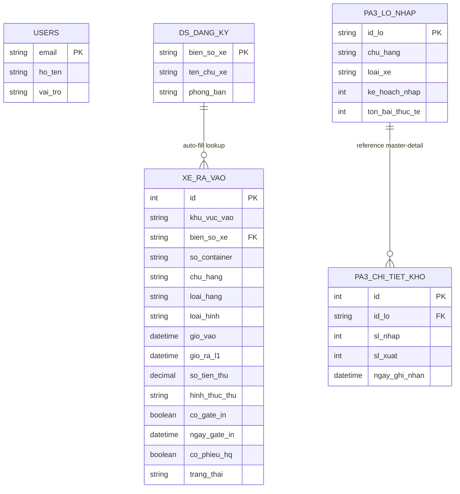
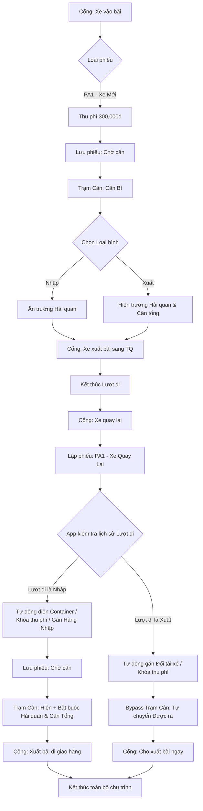
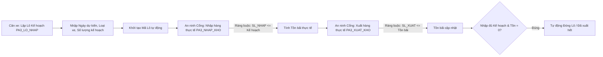
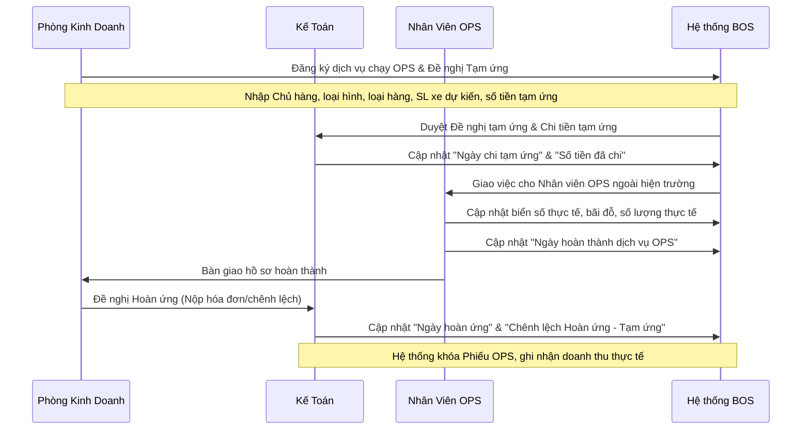

# TÀI LIỆU QUY CHẾ VÀ HƯỚNG DẪN VẬN HÀNH HỆ THỐNG PHÚ ANH HUB V3.0
**Đơn vị áp dụng: Phòng Vận hành & Phòng Kế toán**

---

## 📖 PHẦN I: GIỚI THIỆU CHUNG VỀ HỆ THỐNG

### 1. Mục đích triển khai
Hệ thống **Phú Anh Hub V3.0** được thiết kế và đưa vào vận hành nhằm mục tiêu số hóa toàn diện quy trình kiểm soát phương tiện ra/vào bãi. 
Hệ thống thay thế hoàn toàn sổ sách thủ công, tự động hóa việc ghi nhận thời gian thực (Real-time), chống thất thoát doanh thu, loại bỏ lỗi nhập liệu của con người và tạo nền tảng đối soát kế toán minh bạch, chính xác tuyệt đối.

### 2. Phạm vi quản lý
Hệ thống được lập trình rẽ nhánh tự động để quản lý 4 phân khu nghiệp vụ độc lập nhưng sử dụng chung một cổng kiểm soát:
* **Khu vực PA1 (Trạm Cân & Hải Quan):** Quản lý xe Container xuất/nhập, kiểm soát liên kết chứng từ thông quan (Gate In/Out, Phiếu HQ) và áp dụng quy trình Cân Bì - Cân Tổng.
* **Khu vực PA2 (Bệ Sang Tải):** Điều phối xe Trung Quốc và xe Việt Nam thực hiện công tác bốc xếp, hạ hàng.
* **Khu vực PA3 (Kho Xe Nhập Khẩu):** Quản lý phương tiện mới (Sát xi, Đầu kéo) theo mô hình WMS (Quản lý kho), tự động tính toán số lượng Nhập - Xuất - Tồn theo thời gian thực.
* **Khu vực Xe khách / Công vụ:** Ghi nhận và đối chiếu thông tin phương tiện của Ban Lãnh đạo, khách hàng hoặc đối tác dự án.

### 3. Nguyên tắc Phân quyền (Roles)
Hệ thống áp dụng cơ chế "Bảo mật chéo", mỗi tài khoản chỉ được thao tác đúng nghiệp vụ của mình:

| Vai trò | Phân khu thao tác | Quyền hạn cốt lõi | Các hạn chế bảo mật |
| :--- | :--- | :--- | :--- |
| **`AN_NINH`** (Tổ Bảo vệ) | Cổng Vào, Cổng Ra, Kho PA3 | - Tạo phiếu vào cổng, chụp ảnh thực tế. - Xác nhận xe ra bãi, dập giờ ra. - Nhập/Xuất kho thực tế bãi PA3. | - Không được sửa trường Hải quan (PA1). - Không được sửa Sổ Kế hoạch (PA3). |
| **`CAN_XE`** (Tổ Cân/HQ) | Trạm Cân PA1 | - Cân xác/Cân bì, Cân tổng/Cân hàng. - Phê duyệt chứng từ Hải quan (Gate In/Out, Phiếu HQ). - Lập kế hoạch lô xe mới bãi PA3. | - Không được tạo xe mới tại cổng. - Không được bấm nút cho xe xuất bãi. |
| **`DIEU_PHOI`** (Tổ Điều phối) | Bãi PA2 | - Cập nhật tiến độ bốc xếp hàng hóa bệ bãi. - Ghi chú trạng thái xe cắm điện lạnh, xe chờ ghép. | - Không có quyền thu tiền hay phê duyệt hải quan. |
| **`ADMIN`** (BGĐ & Kế Toán) | Toàn hệ thống | - Toàn quyền cấu hình biểu mẫu, thiết kế workflow. - Xem báo cáo Dashboard thời gian thực. - Kết xuất dữ liệu đối soát doanh thu. | - Quản trị và kiểm tra lịch sử thao tác hệ thống (Audit Logs). |

---

## 🗃️ PHẦN II: CẤU TRÚC CƠ SỞ DỮ LIỆU (DATABASE ARCHITECTURE)

Hệ thống được xây dựng trên cấu trúc dữ liệu liên kết động, gồm các bảng (Tables) chính sau:

---

## 🏗️ PHẦN III: LUỒNG NGHIỆP VỤ CHI TIẾT (OPERATING PROCEDURES)

### 1. QUY TRÌNH 1: LUỒNG XE CONTAINER/HẢI QUAN (Khu vực PA1) - LUỒNG XE QUAY LẠI

> [!IMPORTANT]
> Đây là luồng rẽ nhánh thông minh của hệ thống. Nó tách hành trình xe Container thành 2 lượt (đi - về) tương ứng với 2 phiếu riêng biệt, giúp An ninh dễ bấm cho xe ra vào cổng nhưng vẫn tự động thừa kế dữ liệu và khóa dòng tiền thu phí để chống thu trùng.

#### KỊCH BẢN A: XE CONTAINER NHẬP HÀNG (CÂN BÌ ➔ CÂN TỔNG)

##### 📤 Lượt đi (Cân Xác / Cân Bì)
1. **Tại Cổng (An Ninh):**
   * Mở form ` LẬP PHIẾU CỔNG`, chọn khu vực **`PA1 - Xe Mới`**.
   * Nhập biển số xe (VD: `15C-12345`).
   * **Thu phí 300.000đ** (đã bao gồm lượt về).
   * Lưu phiếu $\rightarrow$ Hệ thống tự động thiết lập trạng thái xe thành **`Chờ cân`** (Màu Đỏ).
2. **Tại Trạm Cân (Nghiệp vụ):**
   * Mở phiếu xe tương ứng, cân bì xác định trọng lượng rỗng.
   * Chọn Loại hình là **`Nhập`** (Xe rỗng sang Trung Quốc lấy hàng về).
   * 🤖 **Hệ thống tự động:** Nhận diện loại hình `Nhập`, lập tức **ẩn toàn bộ các trường Hải Quan** (Gate In/Out, Phiếu HQ) để tối giản form nhập liệu vì xe rỗng chưa phát sinh thông tin Hải quan.
   * Lưu phiếu $\rightarrow$ Trạng thái chuyển sang **`Được ra`** (Màu Xanh).
3. **Tại Cổng (An Ninh):** Bấm nút xác nhận xe xuất bãi sang TQ lấy hàng. Kết thúc Lượt đi.

##### 📥 Lượt về (Chở Hàng Về / Cân Tổng)
1. **Đón xe tại Cổng (An Ninh):**
   * Khi xe `15C-12345` quay lại bãi sau vài tiếng, An Ninh mở form ` LẬP PHIẾU CỔNG`, chọn khu vực **`PA1 - Xe Quay Lại`**.
   * Nhập biển số xe `15C-12345`.
   * 🤖 **Sự kỳ diệu 1 (Auto-fill):** Hệ thống tự động truy vấn lịch sử lượt đi gần nhất để điền sẵn các thông tin như **Số Container**, **Chủ hàng** từ chuyến đi trước đó.
   * 🤖 **Sự kỳ diệu 2 (Khóa dòng tiền):** Ô thu phí **tự động ẩn đi** để tránh thu trùng phí của tài xế.
   * 🤖 **Sự kỳ diệu 3 (Nhận diện nghiệp vụ):** Nhờ dữ liệu lịch sử lượt trước là `Nhập`, hệ thống tự động gán mục đích chuyến này là **`Hàng Nhập (Làm Hải Quan)`**.
   * Lưu phiếu $\rightarrow$ Xe chuyển trạng thái **`Chờ cân`** (Màu Đỏ).
2. **Tại Trạm Cân & Hải Quan (Nghiệp vụ):**
   * Xe xuất hiện trên màn hình cân. Trạm cân tiến hành cân tổng trọng lượng xe và hàng hóa.
   * 🤖 **Sự kỳ diệu 4 (Bắt buộc Hải quan):** Vì hệ thống xác định đây là lượt về chở hàng nhập, nó **tự động hiển thị và bắt buộc nhập** các trường thông tin Hải quan (`Gate In`, `Phiếu HQ`, `Gate Out`).
   * Cân xe cập nhật thông tin và lưu phiếu $\rightarrow$ Trạng thái chuyển sang **`Được ra`** (Màu Xanh).
3. **Tại Cổng (An Ninh):** Bấm cho xe xuất bãi đi giao hàng. Hoàn thành toàn bộ hành trình.

---

#### KỊCH BẢN B: XE XUẤT HÀNG ĐI TQ, QUAY LẠI CHỈ ĐỂ ĐỔI TÀI XẾ

##### 📤 Lượt đi (Có hàng xuất đi TQ)
1. **Tại Cổng:** Chọn khu vực `PA1 - Xe Mới` $\rightarrow$ Thu phí 300.000đ $\rightarrow$ Lưu phiếu.
2. **Tại Trạm Cân:** Chọn Loại hình **`Xuất`**. Thực hiện cân tổng có hàng và nhập đầy đủ thông tin Hải quan $\rightarrow$ Lưu phiếu.
3. **Tại Cổng:** Bấm cho xe xuất bãi sang TQ giao hàng.

##### 📥 Lượt về (Xe rỗng quay về bãi đổi tài xế / cất xe)
1. **Tại Cổng:** An Ninh chọn khu vực **`PA1 - Xe Quay Lại`**, nhập biển số xe.
   * 🤖 **Sự kỳ diệu:** Hệ thống quét lịch sử thấy lượt đi là loại hình `Xuất`, tự động hiểu xe đã giao hàng xong và quay lại chỉ để đổi tài xế hoặc cất xe $\rightarrow$ Tự động gán mục đích là **`Đổi tài xế`**.
   * An Ninh bấm Lưu phiếu.
2. **Bypass (Luồng ưu tiên tự động):**
   * Hệ thống lập tức chuyển trạng thái xe sang **`Được ra`** (Xanh) và chuyển thẳng ra màn hình Cổng Ra.
   * Trạm cân không nhìn thấy xe này trên màn hình làm việc $\rightarrow$ Loại bỏ hoàn toàn công việc thừa, không cần xác nhận thủ công.
3. **Tại Cổng:** Tài xế đổi người xong, An Ninh bấm nút cho xe xuất bãi. Kết thúc hành trình.

---

### 2. QUY TRÌNH 2: KIỂM SOÁT XE KHU VỰC PA2 (BỆ SANG TẢI)

> [!NOTE]
> Quy trình áp dụng luồng xử lý nhanh (Bypass). Phương tiện khu vực này không yêu cầu khai báo Hải quan và không phát sinh thu phí dịch vụ tại cổng.

* **Bước 1: Mở phiếu khai báo (AN NINH CỔNG)**
  1. Mở form ` LẬP PHIẾU CỔNG`, chọn khu vực **`PA2`**.
  2. Nhập biển số phương tiện. **Yêu cầu bắt buộc nhập ít nhất 1 trong 2 trường:** `Biển số TQ` hoặc `Biển số VN` (Gõ vào ô này thì ô kia tự động hết bắt buộc).
  3. Cập nhật các thông tin phụ trợ (nếu có): `Chủ hàng`, `Loại hàng`, `Loại hình` và `Ghi chú`.
  * *Hệ thống tự động:* Các trường hình ảnh và thu tiền tự động bị ẩn đi để tối ưu tốc độ thao tác.
  * *Chuyển bước:* Bấm **Lưu (Save)**. Trạng thái lập tức chuyển sang **`Được ra`** (Màu xanh) và chuyển thẳng dữ liệu sang màn hình Cổng Ra.
* **Bước 2: Cập nhật thông tin bốc xếp (ĐIỀU PHỐI) - Tùy chọn**
  1. Mở tab `📦 TRONG BÃI`, tìm xe PA2 đang thực hiện bốc xếp $\rightarrow$ Bấm **Sửa (Edit)**.
  2. Cập nhật tiến độ bốc xếp hoặc yêu cầu phụ trợ vào trường `Ghi chú` (VD: Xe cắm điện, chờ ghép hàng...).
  3. Bấm **Lưu (Save)**.
* **Bước 3: Xuất bãi (AN NINH CỔNG)**
  1. Mở tab `🚪 CỔNG RA`.
  2. Bấm nút hành động **[✅ CHO XE RA]**.
  3. Xác nhận biển số ➔ Bấm **Đồng ý**. Hệ thống dập giờ ra, kết thúc chuyến đi.

---

### 3. QUY TRÌNH 3: KIỂM SOÁT XE KHÁCH / CÔNG VỤ / DỰ ÁN

> [!NOTE]
> Quy trình tối giản, tích hợp tính năng Auto-fill (Tự động nhận diện) từ Danh bạ phương tiện nội bộ.

* **Bước 1: Quét Biển số (AN NINH CỔNG)**
  1. Mở form ` LẬP PHIẾU CỔNG`, chọn khu vực **`Xe Khách`**.
  2. Nhập `Biển số xe`.
  * 🤖 **Hệ thống tự động:** Ứng dụng lập tức đối chiếu biển số vừa nhập với Bảng `DS_DANG_KY`. Nếu khớp với dữ liệu xe VIP/Công ty, hệ thống **tự động điền** thông tin vào ô `Họ tên tài xế / Chủ xe`.
  3. Nếu là xe ngoài/khách mới: An ninh tiến hành gõ thủ công `Họ tên` và `Mục đích`.
  * *Chuyển bước:* Bấm **Lưu (Save)**. Trạng thái chuyển sang **`Được ra`** (Màu xanh), chờ xuất bãi.
* **Bước 2: Xuất bãi (AN NINH CỔNG)**
  * Bấm nút **[✅ CHO XE RA]** tại Tab CỔNG RA.

---

### 4. QUY TRÌNH 4: QUẢN LÝ KHO XE MỚI (WMS - KHU VỰC PA3)

> [!IMPORTANT]
> Khu vực PA3 được thiết lập theo kiến trúc phần mềm Quản lý Kho (WMS), phân tách rõ ràng quyền "Lập Kế Hoạch" (Kế toán/Cân xe) và quyền "Thực Thi" (An ninh). Dữ liệu quản lý theo Lô, không quản lý theo từng biển số xe riêng lẻ.

* **Bước 1: Lập Kế Hoạch (CÂN XE)**
  1. Mở tab `🚙 KHO PA3`. Bấm biểu tượng **(+)** để tạo Lô Mới.
  2. Chọn `Ngày dự kiến vào`, `Loại xe` (Sát xi, Đầu kéo) và nhập tổng số lượng xe dự kiến về vào trường `Kế hoạch nhập`.
  * *Chuyển bước:* Bấm **Lưu (Save)**. Hệ thống khởi tạo Mã Lô tự động (VD: `FAW-28052026-1234`). Tồn bãi ban đầu = 0.
* **Bước 2: Ghi nhận Nhập bãi thực tế (AN NINH CỔNG)**
  1. Khi đoàn xe nhập kho PA3 đi qua cổng, mở tab `🚙 KHO PA3`.
  2. Tìm Lô kế hoạch tương ứng, bấm nút **[📥 NHẬP HÀNG]**.
  3. Nhập số lượng xe thực tế đi qua cổng ➔ Bấm **Lưu**.
  * 🛑 **Quy định bảo mật:** Hệ thống nghiêm cấm nhập số lượng vượt quá tổng `Kế hoạch nhập`. Nút `📥 NHẬP HÀNG` sẽ tự động ẩn khi số lượng xe đã nhập đủ 100% kế hoạch.
* **Bước 3: Ghi nhận Xuất bãi thực tế (AN NINH CỔNG)**
  1. Khi có xe thuộc Lô PA3 rời bãi, mở tab `🚙 KHO PA3`.
  2. Bấm nút **[📤 XUẤT HÀNG]** cạnh lô xe đó.
  3. Nhập số lượng xe thực xuất ➔ Bấm **Lưu**.
  * 🛑 **Quy định bảo mật:** Hệ thống nghiêm cấm xuất âm kho. Số lượng xuất không được lớn hơn `Tồn bãi thực tế`. Khi Tồn bãi = 0, nút `📤 XUẤT HÀNG` tự động ẩn.
* **Bước 4: Kiểm soát Lịch sử & Đóng Lô (Hệ thống tự động)**
  * Lịch sử chi tiết từng lần bấm Nhập/Xuất của An ninh được lưu vết tại Tab **`📜 LỊCH SỬ PA3`** (Nằm trong menu góc trái).
  * Khi một Lô thỏa mãn 2 điều kiện: (1) Nhập đủ Kế hoạch VÀ (2) Tồn bãi bằng 0 ➔ Hệ thống tự động chuyển trạng thái Lô thành **`Đã xuất hết`** và đẩy xuống cuối danh sách để làm sạch không gian làm việc.

---

### 5. QUY TRÌNH 5: THỐNG KÊ, CHỐT CA VÀ BÁO CÁO TỰ ĐỘNG

#### 1. Bảng điều khiển (Dashboard) - Dành cho Ban Giám Đốc
* **Vị trí:** Tab **`📊 THỐNG KÊ`** (Cấp quyền riêng cho ADMIN).
* **Tính năng:** Hiển thị lưu lượng phương tiện ra vào theo biểu đồ thời gian và tỷ lệ trạng thái (Đang chờ, Đã ra). Hỗ trợ tương tác cảm ứng: Chạm vào biểu đồ để tự động lọc danh sách phương tiện chi tiết phía dưới.

#### 2. Giao ca và Chốt Doanh thu (Dành cho Kế Toán)
* **Khung giờ chốt ca tiêu chuẩn:** Từ `16:00:00` hôm trước đến `15:59:59` hôm nay.
* **Thao tác:** 
  1. Kế toán mở file Google Sheets hệ thống trên máy tính.
  2. Bấm vào Menu ** HỆ THỐNG BÁO CÁO** ➔ Chọn **💰 2. Chốt doanh thu Giao Ca**.
  3. Chọn Ngày ➔ Bấm Xác nhận.
  4. Hệ thống xuất Biên bản Bàn giao Doanh thu (Chuẩn định dạng A4 dọc) bóc tách rõ Tiền mặt / Chuyển khoản, đối soát trực tiếp theo từng biển số xe. Kế toán bấm In (Ctrl+P) để lưu hồ sơ.

#### 3. Xuất Báo cáo Kinh doanh PA1, PA2 (Dành cho Kế Toán)
* **Thao tác:** Bấm Menu ** HỆ THỐNG BÁO CÁO** ➔ Chọn **📊 3. Báo cáo Kinh doanh**.
* **Xử lý thuật toán ngầm:** Robot trí tuệ nhân tạo sẽ tự động dò tìm, khớp biển số của *Lượt đi* (Cân bì) và *Lượt về* (Cân tổng/Hải quan). Ghép nối 2 dòng dữ liệu rời rạc trên App thành 1 dòng dữ liệu liền mạch chuẩn nghiệp vụ trên Excel (Có đầy đủ Giờ vào, Giờ ra, Giờ về cảng, Ngày Gate In, Phiếu HQ). 

#### 4. Hệ thống Cảnh báo tự động (Auto-Bot)
* Đúng **16h00 hàng ngày**, Robot máy chủ sẽ tự động kích hoạt.
* Hệ thống tiến hành thu thập dữ liệu **Báo cáo Tồn bãi thực tế** và **Báo cáo Doanh thu giao ca**.
* Chuyển đổi thành 02 File PDF và tự động gửi Email báo cáo tới Ban Giám đốc và Kế toán trưởng để nghiệm thu ngày làm việc.

---

## ⚙️ PHẦN IV: CẤU HÌNH DANH MỤC DỊCH VỤ LINH HOẠT & HỆ THỐNG ĐIỀU PHỐI, BÁO CÁO

Để loại bỏ hoàn toàn việc quản lý thủ công qua Google Sheets rời rạc, hệ thống **Phú Anh Hub V3.0** số hóa toàn bộ danh mục dịch vụ thành cấu trúc hình cây (Dịch vụ Mẹ $\rightarrow$ Sản phẩm Con) và đồng bộ trực tiếp với Quy trình Điều phối bãi cũng như Báo cáo kinh doanh.

### 1. Thiết lập Cấu trúc hình cây Danh mục Dịch vụ (Service Catalog)

> [!NOTE]
> * **Quy ước mã dịch vụ mẹ:** Bắt đầu bằng tiền tố `QM-` viết liền, CHỮ HOA KHÔNG DẤU đại diện cho Dịch vụ gốc.
> * **Mô hình thừa kế:** Một Dịch vụ Mẹ sẽ quản lý nhiều Sản phẩm Con, tự động áp dụng Loại hàng, Loại xe và các trường thông số đăng ký động khi làm phiếu.

| Mã DV (Mẹ) | Tên Dịch vụ Mẹ | Mã SP (Con) | Tên Sản phẩm Con (Chi tiết) | ĐVT | Quy tắc tính tiền & Tham số đăng ký động |
| :--- | :--- | :--- | :--- | :--- | :--- |
| **`QM-XNKM`** | Xe nhập khẩu mới | `QM-XNKMT1` | DV xe NKM ngày đầu tiên | Xe/ngày | **Đăng ký lúc vào:** Chọn số lô, số lượng, loại xe, ngày đăng ký, ngày vào bãi. Gồm các dịch vụ con đi kèm: Cân xe, lưu bãi, vào vòm. |
| | | `QM-XNKMT2` | DV xe NKM ngày thứ 2 trở đi | Xe/ngày | **Tính tiền tự động:** Lấy số ngày thực tế nằm bãi nhân đơn giá xe/ngày. |
| | | `QM-XNKMT3` | DV Vào Vòm | Xe/lần | Thu thêm phí nếu xe có yêu cầu đỗ vào nhà vòm che chắn. |
| | | `QM-XNKMT4` | DV Cân xe | Xe/lần | Thu phí cân bì/cân hàng của xe. |
| **`QM-CONTLANH`** | Hàng container lạnh | `QM-CONTLANH1` | Vé vào bãi cont lạnh | Xe/lần | **Đăng ký lúc vào:** Tự động kích hoạt hiển thị "Bảng cắm điện" (Module cắm cont lạnh) và "Dịch vụ sang tải" (nhập biển số xe sang tải tương ứng). |
| | | `QM-CONTLANH2` | DV Cân xe | Xe/lần | Cân tải trọng đầu vào. |
| | | `QM-CONTLANH3` | DV lưu đêm cont | Đêm | **Tự động tính ngày lưu đêm:** Dành cho xe đỗ qua đêm từ 22h00 đêm đến 6h00 sáng hôm sau. |
| | | `QM-CONTLANH4` | DV cắm điện cont lạnh | Giờ | **Tự động dập giờ:** Tính số giờ thực tế cắm điện (Rút điện - Cắm điện) $\times$ Đơn giá. |
| | | `QM-CONTLANH5` | Vé vào bãi - Xe bo > 8 tấn | Xe | Áp dụng cho xe bo tải trọng lớn trung chuyển hàng. |
| | | `QM-CONTLANH6` | Vé vào bãi - Xe bo 2-8 tấn | Xe | Trung chuyển hàng trung bình. |
| | | `QM-CONTLANH7` | Vé vào bãi - Xe bo <= 2tấn | Xe | Trung chuyển hàng nhỏ nhẹ. |
| **`QM-HECAUCONT1`** | Nâng hạ container | `QM-HECAUCONT2.1.1` | Cặp cont rỗng 45' | Cặp | **Đăng ký động:** Chọn kích thước cont (45'), trạng thái (Có hàng/Rỗng), nhập Biển số xe cặp (xe giao & xe nhận), giờ đến dự kiến. |
| | | `QM-HECAUCONT2.1.2` | Cặp cont có hàng 45' (<30T) | Cặp | Đảo chuyển cont có hàng tải trọng nhỏ từ xe giao sang xe nhận. |
| | | `QM-HECAUCONT2.2.1` | Cặp cont rỗng < 45' | Cặp | Các kích thước cont 20', 40'... rỗng. |
| | | `QM-HECAUCONT2.2.2` | Cặp cont có hàng < 45' (<30T) | Cặp | Tự động tính tiền theo công thức điều kiện tải trọng. |
| | | `QM-HECAUCONT2.2.3` | Cặp cont có hàng < 45' (>30T) | Cặp | Áp dụng đơn giá cao cho cont quá tải trọng tiêu chuẩn. |
| **`QM-HECAUCONT2`** | Nâng hạ kiện hàng | `QM-HECAUCONT2.2.4` | DV cẩu kiện hàng < 7T | Kiện | **Đăng ký động:** Chọn khối lượng kiện, số kiện, nhập biển số xe cặp (xe giao & xe nhận). |
| | | `QM-HECAUCONT2.2.5` | DV cẩu kiện hàng > 7T | Kiện | Sử dụng cẩu siêu trường siêu trọng. |
| **`QM-XENANG-N1`** | Xe nâng nhóm 1 (Pallet tiêu chuẩn) | `QM-XENANG-N1-K1-20` | Tiêu chuẩn từ 1 - 20 kiện | Kiện | Dành cho kiện tiêu chuẩn thể tích < 2m3, dễ bốc xếp bằng xe nâng. |
| | | `QM-XENANG-N1-K21-50` | Tiêu chuẩn từ 21 - 50 kiện | Kiện | Đơn giá chiết khấu theo số lượng nhiều. |
| | | `QM-XENANG-N1-K51` | Tiêu chuẩn từ 51 kiện trở lên | Kiện | Giá ưu đãi sỉ cho lô hàng lớn. |
| **`QM-XENANG-N2`** | Xe nâng nhóm 2 (Kiện thể tích lớn) | `QM-XENANG-N2-K1-20` | Thể tích lớn từ 1 - 20 kiện | Kiện | Áp dụng cho ván ép, tấm thạch cao, tôn xốp, ván bóc (thể tích lớn, rủi ro thấp). |
| | | `QM-XENANG-N2-K21-50` | Thể tích lớn từ 21 - 50 kiện | Kiện | Giá chiết khấu. |
| | | `QM-XENANG-N2-K51` | Thể tích lớn từ 51 kiện trở lên | Kiện | Giá ưu đãi sỉ. |
| **`QM-XENANG-N3`** | Xe nâng nhóm 3 (Hàng dễ vỡ/nặng) | `QM-XENANG-N3-K1-3` | Kiện dễ vỡ từ 1 - 3 kiện | Kiện | Kiện hàng gạch, kính, đá (thể tích > 1m3, nặng > 2 tấn/pallet), rủi ro cao. |
| | | `QM-XENANG-N3-K4-10` | Kiện dễ vỡ từ 4 - 10 kiện | Kiện | Đơn giá chiết khấu. |
| | | `QM-XENANG-N3-K11-20` | Kiện dễ vỡ từ 11 - 20 kiện | Kiện | Giá chiết khấu tốt hơn. |
| | | `QM-XENANG-N3-K21` | Kiện dễ vỡ từ 21 kiện trở lên | Kiện | Đơn giá tối thiểu cho lô hàng lớn. |
| **`QM-HANGNK`** | Hàng nhập khẩu (HNK) | `QM-HNK` | Dịch vụ bãi hàng nhập khẩu | Lần/Ngày | Đăng ký cho Sầu riêng, Mít, Mía, Điều nhập khẩu. Gồm dịch vụ con: Cân xe, lưu bãi, cắm điện, vào vòm, vệ sinh hoa quả. |
| **`QM-HANGXK`** | Hàng xuất khẩu (HXK) | `QM-HXK` | Dịch vụ bãi hàng xuất khẩu | Lần/Ngày | Tương tự hàng nhập khẩu nhưng áp dụng cho luồng xe chạy hàng xuất sang biên giới. |

---

### 2. Cấu hình các Bước Điều Phối Bãi (Coordinator Steps Workflow)

Các loại hình dịch vụ bãi yêu cầu sang tải, cẩu hạ hay cắm điện được quản lý chặt chẽ qua luồng 6 bước trạng thái độc lập trên hệ thống:

| Tên Bước | 🚚 SANG TẢI (Hàng Tạp) | 🏗️ CẨU CONTAINER (Hàng Cont) | 🔌 CẮM CONTAINER (Cont Lạnh) |
| :--- | :--- | :--- | :--- |
| **BƯỚC 0** | **Đợi xử lý** (Hồ sơ mới lập phiếu xong tại cổng) | **Đợi xử lý** (Hồ sơ mới lập phiếu cổng) | **Đợi xử lý** (Chờ cắm điện) |
| **BƯỚC 1** | **Chờ bục sang tải** (Điều phối xếp bục trống) | **Chờ vị trí cẩu cont** (Chờ bãi cẩu rỗng) | **Chờ vị trí** (Chờ bốt cắm rỗng) |
| **BƯỚC 2** | **Xe vào bục** (Xe giao/nhận khớp vị trí bục) | **Xe vào nhà cẩu cont** (Xe đỗ đúng vị trí cẩu) | **Xe vào vị trí cắm** (Đỗ đúng bốt điện) |
| **BƯỚC 3** | **Cho phép sang tải** (Kỹ thuật/Điều phối giám sát bốc xếp) | **Cho phép cẩu cont** (Vận hành cẩu tiến hành đảo chuyển) | **Cho phép cắm** (Cắm jack điện, ghi nhận Giờ cắm thực tế) |
| **BƯỚC 4** | **Tạm dừng** (Gián đoạn do thời tiết/sự cố) | **Tạm dừng** (Gián đoạn kỹ thuật cẩu) | **Rút cont** (Rút jack điện, ghi nhận Giờ rút thực tế) |
| **BƯỚC 5** | **Hoàn thành** (Bốc xếp xong, xe di chuyển ra cổng ra) | **Hoàn thành** (Đảo cont xong, xe di chuyển ra cổng ra) | **Hoàn thành** (Tính tiền điện tự động, xe di chuyển ra cổng ra) |

---

### 3. Quy trình Đăng ký & Tạm ứng dịch vụ chạy OPS (Phòng Kinh Doanh)

Dành cho phòng Kinh doanh đăng ký dịch vụ chạy tờ khai xuất nhập khẩu (chạy OPS) bến bãi và theo dõi tạm ứng/hoàn ứng tài chính:

* **Công thức đối soát tài chính của Kế toán:**
  $$\text{Chênh lệch Hoàn ứng} = \text{Tổng tiền OPS thực tế} - \text{Số tiền đã Tạm ứng}$$
  * Nếu **Chênh lệch > 0:** Công ty chi thêm tiền cho nhân viên OPS.
  * Nếu **Chênh lệch < 0:** Nhân viên OPS nộp lại tiền thừa về quỹ công ty.

---

### 4. Quy trình đối soát Dịch vụ Cắm Điện Cont Lạnh (PA)

> [!WARNING]
> Kế toán tuyệt đối không tính giờ cắm điện thủ công. Hệ thống tự động ghi nhận thời gian thực tế cắm rút để đối soát doanh thu, tránh sai sót dữ liệu làm tổn thất tài chính bãi cont.

* **Thông tin đối soát chính:**
  * `Thời gian vào` (Ngày/Giờ) & `Thời gian ra` (Ngày/Giờ): Ghi nhận tự động từ Cổng.
  * `Người mua hàng`, `Số CCCD/MST`, `Địa chỉ`: Nhập từ CMT/CCCD của lái xe để phục vụ xuất hóa đơn.
  * `Số giờ cắm điện`: Tính toán tự động theo thời gian thực (tính đến 2 chữ số thập phân).
  * `Đơn giá (h)`: Mặc định là **100.000đ/giờ** (hoặc cấu hình linh hoạt theo loại cont).
  * `Thành tiền`:
    $$\text{Thành tiền cắm cont} = \text{Số giờ cắm} \times \text{Đơn giá (h)}$$
  * `Nộp về quỹ`: Bóc tách rõ ràng theo hình thức thanh toán **Tiền mặt (TM)** hoặc **Chuyển khoản (CK)**.

---
*(Hết tài liệu)*
