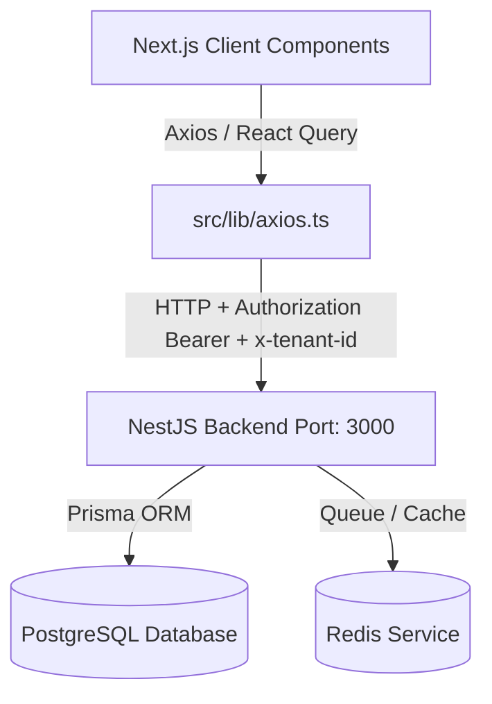

# BOS Platform - Frontend Developer Documentation (Tài liệu Kỹ thuật Frontend)

Hệ thống Frontend của **BOS (Business Operating System)** được xây dựng trên nền tảng **Next.js (App Router)** kết hợp với **TypeScript**, **Ant Design v5** và **Tailwind CSS**. Dự án này hoạt động như một cổng thông tin trung tâm cho mô hình B2B SaaS đa doanh nghiệp (Multi-tenant), kết nối trực tiếp với backend sử dụng **NestJS**.

Tài liệu này cung cấp các hướng dẫn chi tiết về cấu trúc mã nguồn, cơ chế tích hợp API, hệ thống giao diện, và cách thức vận hành các luồng nghiệp vụ động (Low-code Engine) trong hệ thống.

---

## 1. Kiến trúc Tổng quan (Architecture Overview)

Kiến trúc vận hành của BOS tuân thủ mô hình phân tách rõ ràng giữa giao diện Client, trung gian API Client, và máy chủ Backend:



- **Next.js (App Router):** Xử lý định tuyến và giao diện dạng Client-side Rendering (do yêu cầu cao về tính tương tác của các bảng kéo thả low-code).
- **React Query (TanStack Query v5):** Quản lý đồng bộ trạng thái server (Server State Management), xử lý cache, tự động re-validate dữ liệu và tối ưu hiệu năng tải.
- **Axios:** Thư viện HTTP client đảm nhiệm việc liên lạc dữ liệu thô, tích hợp interceptors quản lý token bảo mật.

---

## 2. Cấu trúc Thư mục Dự án (Folder Structure)

Dự án frontend được tổ chức khoa học để dễ dàng mở rộng quy mô tính năng:

```bash
frontend-nextjs/
├── public/                 # Các tài nguyên tĩnh (Hình ảnh, fonts, v.v...)
├── src/
│   ├── app/                # Các Router và View của ứng dụng (App Router)
│   │   ├── auth/           # Module xác thực (Đăng nhập & Đăng ký Tenant)
│   │   │   ├── login/
│   │   │   └── register/
│   │   ├── metadata/       # Trình thiết kế biểu mẫu động (Low-code Engine)
│   │   │   ├── [id]/
│   │   │   │   └── fields/
│   │   │   │       └── components/ # Canvas, Toolbox, FormulaBuilder
│   │   │   └── page.tsx
│   │   ├── organization/   # Sơ đồ phòng ban, Quản lý Nhân sự & Phân quyền ma trận
│   │   │   └── page.tsx
│   │   ├── globals.css     # Định nghĩa CSS toàn cục (Tailwind imports)
│   │   ├── layout.tsx      # Layout gốc tích hợp AntD registry & Theme variables
│   │   └── page.tsx        # Bảng điều khiển Trung tâm (Dashboard Portal)
│   ├── hooks/              # Tập hợp Custom Hooks xử lý API (React Query)
│   │   ├── useAuth.ts
│   │   ├── useDepartments.ts
│   │   ├── useEntities.ts
│   │   ├── useFields.ts
│   │   ├── useRoles.ts
│   │   ├── useUsers.ts
│   │   └── useWorkflows.ts
│   ├── lib/                # Cấu hình thư viện trung gian
│   │   ├── antd-registry.tsx  # Tránh lỗi nhấp nháy CSS trên SSR của AntD
│   │   └── axios.ts        # Cấu hình Axios Interceptors
│   ├── providers/          # Chứa các Provider bọc ứng dụng (QueryProvider)
│   └── types/              # Định nghĩa Typescript đồng bộ dữ liệu với Backend DTOs
│       ├── api.ts
│       └── auth.ts
├── postcss.config.js
├── tailwind.config.ts      # Cấu hình tích hợp Tailwind CSS
├── tsconfig.json           # Cấu hình TypeScript
└── package.json            # Script chạy dự án và danh sách dependencies
```

---

## 3. Tích hợp API & Xác thực Đa doanh nghiệp

Tất cả các truy vấn dữ liệu từ Frontend đến Backend đều phải đi qua Axios client tại [src/lib/axios.ts](file:///Users/mac/QuangMinh/software/BOS/bos-workspace/frontend-nextjs/src/lib/axios.ts).

### 3.1. Quản lý Tokens và Tenant Isolation
Cơ chế cô lập dữ liệu (Tenant Isolation) yêu cầu client đính kèm mã định danh của Tenant hiện tại trong mỗi request.

- **JWT Token:** Sau khi người dùng đăng nhập thành công qua `/api/v1/auth/login`, token JWT sẽ được trả về trong trường `accessToken` và lưu vào LocalStorage dưới key `bos_token`.
- **Tenant ID:** Mã ID của doanh nghiệp được lưu vào LocalStorage dưới key `bos_tenant_id`.

### 3.2. Cấu hình Axios Request Interceptor
Interceptor tự động chèn token và tenant ID vào headers của từng request:

```typescript
api.interceptors.request.use(
  (config) => {
    if (typeof window !== 'undefined') {
      const token = localStorage.getItem('bos_token');
      const tenantId = localStorage.getItem('bos_tenant_id');
      
      if (token) {
        config.headers.Authorization = `Bearer ${token}`;
      }
      if (tenantId) {
        config.headers['x-tenant-id'] = tenantId;
      }
    }
    return config;
  },
  (error) => Promise.reject(error)
);
```

---

## 4. Chi tiết các Module Nghiệp vụ & Bản đồ API

Frontend của ứng dụng BOS ánh xạ trực tiếp đến các controller nghiệp vụ của NestJS backend:

### 4.1. Module Xác thực (Auth)
- **Đăng ký doanh nghiệp mới (Tenant Onboarding):**
  - Giao diện: `/auth/register` (Tạo mới Tenant và tài khoản Quản trị cấp cao).
  - API tương ứng: `POST /api/v1/auth/register-tenant` -> Nhận payload `RegisterTenantDto`.
- **Đăng nhập (Login):**
  - Giao diện: `/auth/login` (Xác thực tài khoản thành viên).
  - API tương ứng: `POST /api/v1/auth/login` -> Trả về `accessToken` và thông tin người dùng.

### 4.2. Cơ cấu Tổ chức (Organization)
Toàn bộ nghiệp vụ được tích hợp trong trang `/organization` sử dụng giao diện dạng thẻ tab phân mảnh:

| Tab Chức năng | Component / Hook Sử dụng | API Endpoint tương ứng | Mô tả Nghiệp vụ |
| :--- | :--- | :--- | :--- |
| **Sơ đồ Phòng ban** | `Tree` / [useDepartments.ts](file:///Users/mac/QuangMinh/software/BOS/bos-workspace/frontend-nextjs/src/hooks/useDepartments.ts) | `GET/POST/PATCH/DELETE` `/api/v1/departments` | Hiển thị và cập nhật cây phòng ban sử dụng thuật toán **Closure Table** ở Backend. Hỗ trợ tạo nhánh con, sửa tên, và xóa nút lá. |
| **Thành viên** | `Table` / [useUsers.ts](file:///Users/mac/QuangMinh/software/BOS/bos-workspace/frontend-nextjs/src/hooks/useUsers.ts) | `GET/POST/PATCH/DELETE` `/api/v1/users` | Quản lý thông tin tài khoản nhân viên trực thuộc các phòng ban và gán Vai trò (Role). |
| **Vai trò & RBAC** | `Table` / [useRoles.ts](file:///Users/mac/QuangMinh/software/BOS/bos-workspace/frontend-nextjs/src/hooks/useRoles.ts) | `GET/POST/PATCH/DELETE` `/api/v1/roles` | Tạo mới vai trò và gán quyền chức năng tương ứng thông qua giao diện Ma trận Phân quyền. |

> [!NOTE]
> **Quy tắc Xóa cứng Phòng ban / Vai trò:** Hệ thống backend triển khai ràng buộc khóa ngoại chặt chẽ. Khi tiến hành xóa phòng ban hoặc vai trò đang có dữ liệu nhân viên liên kết, frontend sử dụng `App.useApp()` để mở Modal thông báo lỗi nghiệp vụ chi tiết thay vì để lỗi crash thô từ Server.

---

### 4.3. Động hóa Biểu mẫu (Metadata & Fields Engine - Low-code)
Đây là tính năng cốt lõi giúp hệ thống tự định nghĩa cấu trúc dữ liệu mà không cần can thiệp vào mã nguồn:

1. **Khởi tạo Thực thể (Entities):**
   - Đường dẫn: `/metadata`
   - API: `GET/POST/PATCH/DELETE` `/api/v1/entities`
   - Thuộc tính quan trọng: `autoCodePattern` - Mẫu định dạng mã nghiệp vụ tự động sinh (Ví dụ: `QTMS-{SEQ:4}`).
2. **Thiết kế Trường dữ liệu (Fields Designer Canvas):**
   - Đường dẫn: `/metadata/[id]/fields`
   - API: `GET/POST/PATCH/DELETE` `/api/v1/fields`
   - Các nhóm kiểu dữ liệu được thiết kế kéo thả trực quan trên Canvas:
     - **Nhóm Văn bản:** `TEXT`, `TEXTAREA`, `EMAIL`, `PHONE`.
     - **Nhóm Số liệu:** `NUMBER`, `DECIMAL`, `CURRENCY` (Đơn vị tiền tệ), `PERCENTAGE`.
     - **Nhóm Thời gian:** `DATE`, `TIME`, `DATETIME`, `MONTH_YEAR`.
     - **Nhóm Liên kết & Tham chiếu:** `SELECT`, `MULTI_SELECT`, `CHECKBOX`, `USER_REF` (Thành viên hệ thống), `DEPT_REF` (Phòng ban), `ROLE_REF` (Vai trò).
     - **Nhóm Nâng cao:** 
       - `LOOKUP`: Truy xuất lấy dữ liệu động từ thực thể khác.
       - `FORMULA`: Thiết lập biểu thức tự động tính toán (ví dụ: `[price] * [quantity]`).
       - `TABLE`: Nhập liệu lưới bảng phụ (Grid con) bên trong biểu mẫu lớn.

#### 4.3.1. Kéo thả Sắp xếp & Điều kiện logic nâng cao
Tính năng biểu mẫu động được tối ưu hóa sâu sắc với hai thành phần trải nghiệm người dùng nâng cao:
- **Kéo thả Sắp xếp (HTML5 Drag & Drop):**
  - Tích hợp trực tiếp trên Canvas [DragDropCanvas.tsx](file:///Users/mac/QuangMinh/software/BOS/bos-workspace/frontend-nextjs/src/app/metadata/%5Bid%5D/fields/components/DragDropCanvas.tsx) với các hiệu ứng thay đổi viền và độ mờ khi kéo thả.
  - Khi thả, danh sách trường được tính toán lại chỉ số `orderIndex` và tự động gửi yêu cầu cập nhật API tuần tự lên máy chủ PostgreSQL.
- **Điều kiện Hiển thị (showIf) & Bắt buộc (requiredIf):**
  - Quản trị viên có thể thiết lập các luật so sánh đơn hoặc đa điều kiện (AND/OR) của trường này dựa trên giá trị của trường khác ngay trên Inspector của [ToolboxAndInspector.tsx](file:///Users/mac/QuangMinh/software/BOS/bos-workspace/frontend-nextjs/src/app/metadata/%5Bid%5D/fields/components/ToolboxAndInspector.tsx).
  - Giao diện hỗ trợ so sánh Bằng (`EQUALS`), Khác (`NOT_EQUALS`), Chứa chuỗi (`CONTAINS`), Kiểm tra Trống (`IS_EMPTY` / `IS_NOT_EMPTY`).
  - Các trường được thiết lập điều kiện sẽ tự động hiển thị Tag tóm tắt trực quan trên Canvas (ví dụ: `👁 showIf: AND ([status] == 'APPROVED')`).

---

### 4.4. Quy trình & Phân quyền Bước (Workflow Pipeline Integration)
Quy trình phê duyệt tự động của BOS dựa trên đặc tả quy trình động (Dynamic Workflow Engine):
- **Xem phiên bản:** `GET /api/v1/workflows?entityId=...` lấy danh sách quy trình thuộc biểu mẫu.
- **Tải các bước duyệt:** `GET /api/v1/workflow-pipeline/versions/${versionId}` tải danh sách trạng thái duyệt (`WorkflowStep`).
- **Phân quyền bước động (Field Permissions per Step):**
  Trong quá trình xem và duyệt biểu mẫu, mỗi bước phê duyệt (ví dụ: *Chờ Kế toán duyệt*) sẽ áp đặt các quyền khác nhau lên từng trường dữ liệu của biểu mẫu đó.
  - Các mức quyền gồm: `WRITE` (Được chỉnh sửa), `READ` (Chỉ xem), `HIDDEN` (Ẩn hoàn toàn khỏi giao diện).
  - Sự thay đổi trạng thái quyền được cập nhật thời gian thực về database qua API:
    `PATCH /api/v1/workflow-pipeline/steps/${stepId}` với dữ liệu phân quyền dạng map JSON:
    ```json
    {
      "permissions": {
        "FIELD_CODE_A": "WRITE",
        "FIELD_CODE_B": "READ",
        "FIELD_CODE_C": "HIDDEN"
      }
    }
    ```

---

## 5. Hệ thống Giao diện & Styling System

Để đảm bảo hiệu năng và tính thẩm mỹ cao nhất mà không phát sinh xung đột, dự án sử dụng chiến lược CSS lai:

### 5.1. Ant Design v5 + Tailwind CSS Integration
Tích hợp Tailwind CSS để xây dựng layout nhanh chóng, đồng thời giữ nguyên thư viện Ant Design cho các widget dữ liệu phức tạp. Để tránh Tailwind reset đè lên CSS của Ant Design, thuộc tính **Preflight** đã được vô hiệu hóa trong [tailwind.config.ts](file:///Users/mac/QuangMinh/software/BOS/bos-workspace/frontend-nextjs/tailwind.config.ts):

```typescript
// tailwind.config.ts
const config: Config = {
  corePlugins: {
    preflight: false, // Tắt reset CSS mặc định của Tailwind
  },
};
```

### 5.2. Đồng bộ Theme trong layout.tsx
Màu sắc hoàng gia Navy và các token cấu hình bo góc được đồng bộ toàn cục qua `ConfigProvider` của Ant Design tại [layout.tsx](file:///Users/mac/QuangMinh/software/BOS/bos-workspace/frontend-nextjs/src/app/layout.tsx):

```typescript
<ConfigProvider
  theme={{
    token: {
      colorPrimary: "#0050b3",     // Royal Navy Blue
      colorBgBase: "#f8fafc",       // Soft Slate Grey
      borderRadius: 8,             // Chuẩn bo góc hệ thống
      fontFamily: "'Inter', sans-serif",
    },
  }}
>
  <App>
    {children}
  </App>
</ConfigProvider>
```

> [!IMPORTANT]
> **Lưu ý React 19 / AntD Context Bridge:** Component `<App>` bọc ngoài cùng bắt buộc phải được kích hoạt. Điều này giải quyết triệt để vấn đề "Static context consume error" trong React 19 khi gọi các hàm thông báo tĩnh như `message.success()` hay `modal.error()` từ các luồng callback bên ngoài.

---

## 6. Hướng dẫn Khởi chạy và Thiết lập Dự án

### 6.1. File cấu hình Môi trường `.env.local`
Tạo file `.env.local` tại thư mục gốc của frontend:

```env
NEXT_PUBLIC_API_URL=http://localhost:3000
```

### 6.2. Cài đặt và Khởi chạy
Tại thư mục `bos-workspace/frontend-nextjs`:

```bash
# 1. Cài đặt các gói phụ thuộc
npm install

# 2. Khởi chạy server phát triển (Port mặc định đã được đổi thành 3002)
npm run dev
```

Sau khi khởi chạy thành công, truy cập giao diện tại: `http://localhost:3002`.

### 6.3. Khắc phục Sự cố Cache Turbopack
Trong quá trình phát triển, nếu tắt đột ngột dev server khi trình biên dịch Turbopack đang tối ưu hóa dữ liệu, bộ nhớ cache có thể bị hỏng (corrupted cache) dẫn đến lỗi build giả.
**Cách xử lý nhanh:**
```bash
rm -rf .next
npm run dev
```
