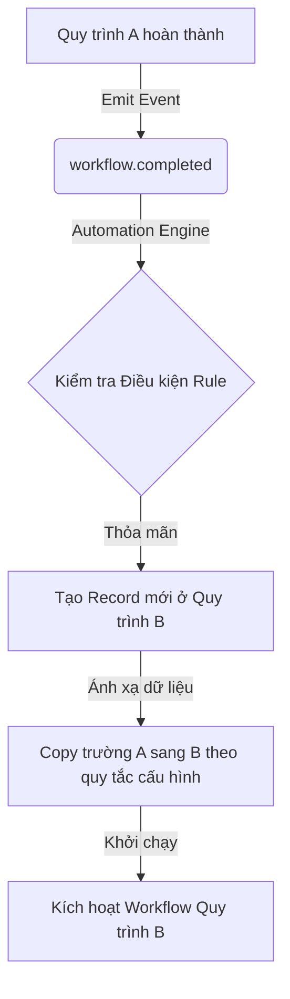

# Bản rà soát dự án & Danh sách chức năng tương lai (Future Features Checklist)

Tài liệu này đánh giá hiện trạng kiến trúc của hệ thống **BOS (Business Operating System)**, xác định các khoản nợ kỹ thuật (technical debt) và đề xuất danh mục các tính năng phát triển trong tương lai theo thứ tự ưu tiên.

---

## 📌 1. Rà soát dự án & Đánh giá Kiến trúc Hiện tại

Hệ thống BOS hiện tại là một nền tảng SaaS Multi-tenant quản lý quy trình doanh nghiệp (BPM) và hồ sơ động (Dynamic Records). Dưới đây là kết quả rà soát chi tiết:

### ⚡ Ưu điểm nổi bật:
* **Multi-tenancy RLS Cứng:** Thiết kế phân tách dữ liệu rõ ràng qua middleware của Prisma, giúp cô lập dữ liệu giữa các doanh nghiệp độc lập.
* **Cấu hình Động (Dynamic Schemas):** Hỗ trợ xây dựng Biểu mẫu động bằng kéo thả, lưu trữ dữ liệu dạng JSON linh hoạt (`data` JSON field).
* **Quy trình Phê duyệt Trực quan (Workflow Canvas):** Cho phép vẽ sơ đồ quy trình bằng các node, cấu hình rẽ nhánh với biểu thức điều kiện tự động skip.
* **Quyền Động theo Bước Duyệt:** Phân tách quyền `READ`, `WRITE`, `HIDDEN` cho từng trường thông tin ở mỗi trạm phê duyệt.
* **Cơ chế tải lên an toàn (S3/R2):** Sử dụng liên kết tải lên bảo mật và Presigned URL thời hạn ngắn (15 phút) để xem trước/tải xuống tệp tin.

### ⚠️ Khoản nợ Kỹ thuật & Điểm cần Cải thiện (Technical Debt):
1. **Lịch biểu & SLA:** Hiện chưa cấu hình tự động tính toán thời hạn xử lý nhiệm vụ (SLA) dựa trên lịch làm việc thực tế (Shift, Holiday) dù DB đã có bảng `BusinessCalendar`.
2. **Tìm kiếm Toàn văn:** DB có sẵn bảng `SearchDocument` sử dụng `tsvector` nhưng việc đồng bộ từ `Record` sang `SearchDocument` khi cập nhật hồ sơ chưa được thực hiện tự động bằng trigger hoặc CDC (Change Data Capture).
3. **Queue / Event Processing:** `AutomationService` đang sử dụng `@OnEvent` đồng bộ. Nếu số lượng rule tăng lên, các xử lý nặng có thể làm chậm luồng chính. Nên chuyển hoàn toàn qua hàng đợi BullMQ đã cấu hình sẵn.
4. **Quản lý Phiên bản:** Chưa có giao diện giúp khôi phục các phiên bản cũ của Biểu mẫu (`EntityVersion`) khi cấu hình biểu mẫu bị lỗi.

---

## 🚀 2. Danh sách Chức năng Tương lai (Future Features Checklist)

Dưới đây là sơ đồ phát triển các tính năng tiếp theo, bắt đầu từ yêu cầu kết nối chuỗi quy trình tự động và mở rộng các phân hệ sẵn có.

### 🌟 Giai đoạn 1: Liên kết Quy trình & Tự động hóa (Workflow Chaining & Automation Engine)
- [ ] **Tự động sinh hồ sơ & chạy Quy trình mới:**
  - Lắng nghe sự kiện `workflow.completed` khi một hồ sơ hoàn thành chuỗi phê duyệt của nó.
  - Cấu hình quy tắc tự động hóa mới: **Hành động `START_WORKFLOW`**.
  - Thiết lập giao diện ánh xạ dữ liệu (Field Mapping Config) giữa biểu mẫu nguồn và biểu mẫu đích.
- [ ] **Cấu hình Quy tắc Tự động hóa (Automation Rules Engine - Lựa chọn 2):**
  - **Backend:** Xây dựng bộ điều khiển (`AutomationController`) để cung cấp REST API quản lý quy tắc tự động hóa (`AutomationRule` CRUD).
  - **Frontend:** Thiết kế giao diện quản lý quy tắc động trong tab "Quy tắc Tự động".
  - Hỗ trợ xây dựng biểu thức điều kiện trực quan (Condition Builder) và chọn hành động tự động (`SEND_EMAIL`, `SEND_WEBHOOK`, `CREATE_TASK`, `START_WORKFLOW`).
- [ ] **Quản lý & In ấn/Xuất file Hồ sơ theo Mẫu (Print Templates):**
  - **Backend:** Đã có `PrintTemplatesService` hỗ trợ xuất template HTML động và điền dữ liệu kèm chữ ký phê duyệt.
  - **Frontend:** Xây dựng giao diện thiết kế mẫu in HTML/CSS cho từng Biểu mẫu (`Entity`). Cho phép chọn và chèn token dữ liệu như `{{ data.my_field }}` và `{{ approvals }}`.
  - **Action:** Thêm nút "In hồ sơ (Print Preview / Export PDF)" tại giao diện chi tiết hồ sơ, gọi lệnh `window.print()` của trình duyệt.
- [ ] **Tối ưu hóa bộ máy Automation Rules:**
  - Chuyển toàn bộ các hành động tự động (`SEND_EMAIL`, `SEND_WEBHOOK`, `START_WORKFLOW`) sang hàng đợi bất đồng bộ (BullMQ) để tăng hiệu suất.
  - Thêm hành động cập nhật trạng thái hoặc giá trị trường của biểu mẫu khác dựa trên quan hệ (`RecordRelation`).

### 📊 Giai đoạn 2: Phân tích & Báo cáo Hiệu suất (Analytics & SLA)
- [ ] **Giám sát thời gian hoàn thành (SLA Monitor):**
  - Cảnh báo hồ sơ trễ hạn bằng Email hoặc thông báo Notification trên giao diện.
  - Tích hợp lịch làm việc của Doanh nghiệp (`BusinessCalendar`) để tính thời hạn loại trừ thứ Bảy, Chủ nhật và ngày lễ.
- [ ] **Dashboard Phân tích (Business Intelligence):**
  - Biểu đồ thống kê số lượng hồ sơ theo trạng thái, phòng ban.
  - Thống kê thời gian xử lý trung bình của từng nhân sự, phát hiện điểm nghẽn (bottleneck) trong chuỗi quy trình.

### 🔒 Giai đoạn 3: Ký số & Bảo mật nâng cao (Compliance & Signatures)
- [ ] **Tích hợp Chữ ký số:**
  - Cho phép người phê duyệt xác thực giao dịch bằng mã OTP hoặc Token chữ ký số cá nhân/doanh nghiệp (CA - Certificate Authority) ở bước phê duyệt cuối cùng.
  - Xuất file PDF hồ sơ đã hoàn thành kèm theo con dấu số và dấu mộc điện tử của doanh nghiệp.
- [ ] **Lịch sử thay đổi chi tiết (Audit Trail Explorer):**
  - Giao diện trực quan hiển thị diff dữ liệu (so sánh giá trị cũ và mới) của hồ sơ qua từng phiên bản chỉnh sửa (`RecordRevision`).

### 🛠️ Giai đoạn 4: Trải nghiệm Người dùng (Advanced UX/UI)
- [ ] **Phê duyệt nhanh hàng loạt (Batch Approvals):**
  - Cho phép quản lý chọn nhiều nhiệm vụ cùng lúc trên Dashboard và click "Duyệt nhanh" thay vì phải mở từng hồ sơ.
- [ ] **Tùy biến thương hiệu doanh nghiệp (White-labeling & Custom Domains):**
  - Cho phép Super Admin cấu hình tên miền riêng cho từng Doanh nghiệp (Ví dụ: `app.vantai-bos.vn` trỏ về Tenant 1).
  - Tùy chỉnh màu sắc chủ đạo, logo doanh nghiệp hiển thị trên trang Đăng nhập và Header.

### 💬 Giai đoạn 5: Tích hợp Kênh giao tiếp & Chatbot (Communication & Bot Integrations)
- [ ] **Tương tác qua Slack/Microsoft Teams/Telegram:**
  - Gửi thông báo nhiệm vụ mới trực tiếp qua chatbot Telegram, Slack hoặc MS Teams.
  - Hỗ trợ các nút bấm tương tác (Interactive Buttons) để người phê duyệt có thể bấm Duyệt/Từ chối hồ sơ ngay trong cửa sổ chat mà không cần mở website.
- [ ] **Email phê duyệt trực tiếp (Direct Email Action):**
  - Người dùng có thể trả lời email thông báo bằng cú pháp `[Approve]` hoặc `[Reject]` kèm ý kiến phản hồi để hệ thống tự động xử lý bước tiếp theo.

### 🧠 Giai đoạn 6: AI Assistant & Tối ưu hóa Quy trình thông minh (AI & Process Mining)
- [ ] **Trợ lý AI phân tích dữ liệu & dự báo:**
  - Tích hợp mô hình ngôn ngữ lớn (LLM) để phân tích nội dung tệp tin đính kèm (hóa đơn, hợp đồng) và tự động điền thông tin (OCR) vào biểu mẫu.
  - AI phát hiện điểm nghẽn (Process Bottlenecks): Dự báo và đưa ra gợi ý tối ưu quy trình dựa trên thời gian xử lý lịch sử.
- [ ] **Bộ công thức Excel nâng cao (Formula Engine v2):**
  - Hỗ trợ các hàm logic phức tạp (`IF`, `AND`, `OR`), hàm xử lý chuỗi (`CONCAT`, `SUBSTRING`), và các hàm ngày tháng (`DATEDIFF`, `DATEADD`) trong trình thiết kế biểu mẫu.

### 📅 Giai đoạn 7: Phân hệ Ủy quyền & Hành chính nâng cao (Delegation & Admin Features)
- [ ] **Ủy quyền Phê duyệt tự động (Approval Delegation):**
  - Cho phép thành viên cấu hình thời gian vắng mặt (Out-of-office) và chọn người được ủy quyền để tự động chuyển tiếp nhiệm vụ trong khoảng thời gian cấu hình.
- [ ] **Kho tài liệu Doanh nghiệp tập trung (Centralized Drive):**
  - Giao diện quản lý toàn bộ tệp đính kèm (`Attachment`) của Doanh nghiệp dưới dạng thư mục, hỗ trợ gắn nhãn phân loại (Tags), phân quyền truy cập và tìm kiếm nâng cao.

---

## 📈 Kế hoạch triển khai Tính năng liên kết Quy trình tự động

### 📋 Checklist Thiết kế & Backend:
1. **Event Emit:** Bắn sự kiện `workflow.completed` khi `WorkflowsService.handleAction` xác định hồ sơ chuyển sang trạng thái kết thúc thành công.
2. **Action START_WORKFLOW:** Trong `AutomationService`, thêm mã nguồn xử lý loại hành động `START_WORKFLOW` nhận cấu hình:
   * `targetEntityId`: Biểu mẫu đích muốn khởi tạo.
   * `targetWorkflowId`: Quy trình đích muốn kích hoạt.
   * `fieldMapping`: JSON ánh xạ cột nguồn -> cột đích (ví dụ: `{"so_tien": "total_amount", "nhan_vien": "requester_id"}`).
3. **Field Mapping Logic:** Đọc dữ liệu từ bản ghi cũ, tạo bản ghi mới với giá trị tương ứng, giữ nguyên tính đóng gói bảo mật theo `tenantId`.

### 💻 Giao diện Cấu hình (Frontend):
1. Thêm tab **"Quy tắc Tự động (Automations)"** cạnh tab Sơ đồ Quy trình.
2. Form cấu hình trực quan:
   * **Khi:** Quy trình kết thúc.
   * **Nếu điều kiện:** `so_tien > 50000000` (sử dụng bộ Condition Builder có sẵn).
   * **Thì:** Tự động tạo hồ sơ Quy trình phê duyệt chi tiền.
   * **Ánh xạ thông tin:** [Trường quy trình A] $\rightarrow$ [Trường quy trình B].
